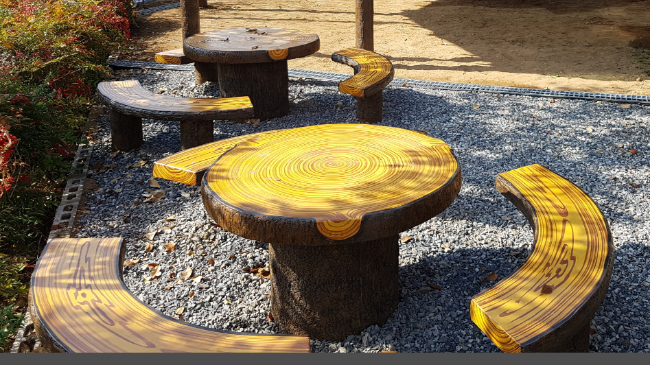

# YJ Lounge
팀 이름 : ? (정진솔, 황용연)

## 스케줄

2024\. 3\. 4\. 프로젝트 시작  
2024\. 3\. 8\. 프로젝트 1차 중간 발표  
2024\. 3\. 15\. 프로젝트 2차 중간 발표  
2024\. 3\. 17\. 발표 자료, 포트폴리오 완성  
2024\. 3\. 18\. 프로젝트 최종 발표일  

## 개발 환경

Unity 2022\.3\.9f1  

## 현재 과제 (연구/시도해볼 것들)

### 2024\. 3\. 4\.

- [x] 기본맵 생성  
- [x] 바닥 타일링 테스트  

### 2024\. 3\. 5\.

- [ ] 부스 동선에 따른 정보 정리: 어떤 곳인가 -> 무엇을 배우는 곳인가 -> 우리 기수 포트폴리오  
- [ ] NPC 상호작용 스크립트(대본) 작성
- [ ] 대화시스템 컷씬 (타임라인, 시네머신 등 이용)
- [ ] 위치 안내 선택지: 화면 상으로 입체 알려주기  
- [ ] 링크 UI [#1](https://www.youtube.com/watch?v=BRoInRutZIU) [#2](https://geukggom.tistory.com/150)

중요도가 떨어지는 작업  

- [ ] 어도비 일러스트레이터로 영진직업전문학교 로고 딴 뒤 3D화  
- [ ] 어도비로 최우수 훈련기관 마크 로고 딴 뒤 3D화  
- [ ] 조경 국가자격검정장에 설치된 테이블과 벤치 모델링  
  
  

<s>동영상 재생 유튜브 링크로 (유니티 내부 기능 있음) > 현재 관련 기능 패키지 설치 완료했습니다.</s>  

>유튜브 측에서 이용 약관 상으로 유튜브 영상의 브라우저 외 재생을 금지했습니다.  
>(공식 앱, 공식 임베드, 공식 링크 외의 방법은 계약 위반 사항)  
>
>[WebView](https://github.com/gree/unity-webview)를 [사용하면](https://ljhyunstory.tistory.com/266) 가능한데 윈도우 빌드에서는 쓸 수 없어서  
>아무래도 링크를 사용하는 방법 밖에는 없는 것 같습니다.

## 모델링 시 주의사항

[모델링 치수와 유니티 단위 스케일](https://docs.unity3d.com/kr/2018.4/Manual/BestPracticeMakingBelievableVisuals1.html)

## 폴더에 관한 내용

### Assets > Scenes

Start: 시작 화면  
Main: 메인 화면

### 기타
 
Scripts: 스크립트 한데 모아놓는 곳. 복잡해지면 편의상 이 안에 따로 폴더를 만들 수도 있어요.  

## 필요한 기능에 대한 정보들

## 기타 개발상 편의 내용에 관한 정보들
[마크다운으로 Readme.md 파일을 만들어보자!](https://gist.github.com/ihoneymon/652be052a0727ad59601)  

## 개발일지

2024\. 3\. 4\. 개발용 씬, 캐릭터 모델, 바닥 타일링 추가  

  

2024\. 3\. 5\.
[마크다운으로 Readme.md 파일을 만들어보자!](https://gist.github.com/ihoneymon/652be052a0727ad59601)  

## 개발일지

2024\. 3\. 4\. 개발용 씬, 캐릭터 모델, 바닥 타일링 추가  

  

2024\. 3\. 5\.